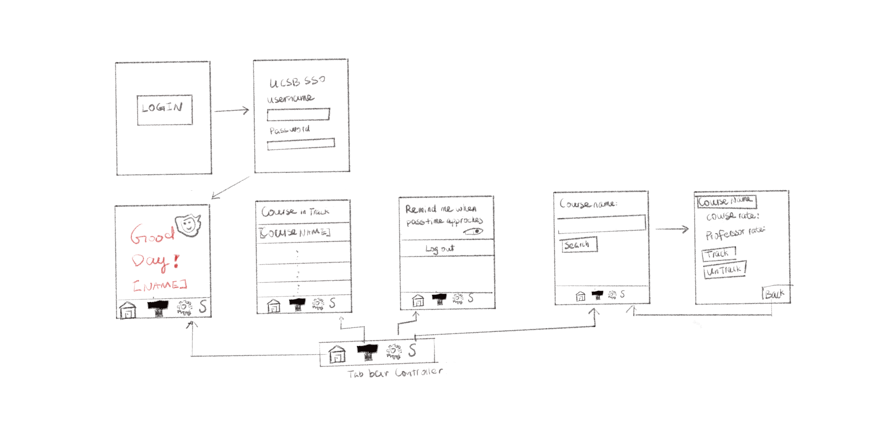

Original App Design Project - README Template
===

# Silver

## Table of Contents
1. [Overview](#Overview)
2. [Product Spec](#Product-Spec)
3. [Wireframes](#Wireframes)
4. [Schema](#Schema)

## Overview
### Description
This app is a mobile version of GOLD (Gaucho On-Line Data) on iOS platforms. It allows students to access many services provided by GOLD without using the browser which usually induces poor user experiences on mobile devices. 

### App Evaluation
[Evaluation of your app across the following attributes]
- **Category:** Education
- **Mobile:** This app would be developed for iOS only. 
- **Story:** Using the iphone browser to perform some simple tasks on GOLD such as checking the passtime is inconvinient and unnecessarily complicated sometimes. Moreover, the GOLD UI is not friendly to mobile users. Thus, we decided to build this app as one more layer above GOLD to make it convinient to accomplish simple tasks that should originally be done on Gold with a browser. 
- **Market:** This app can be used by current UCSB undergraduate students only.
- **Habit:** This app could be used whenever students want to access personal and course information.
- **Scope:** This app provides iOS users with an alternative for accessing GOLD in a browser. Some core features of GOLD like adding to courses are not contained in the app.

## Product Spec

### 1. User Stories (Required and Optional)

**Required Must-have Stories**

* User logs in and logs out
* User sees basic info
* User sees registration info
* User sees schedule
* User can search for a course

**Optional Nice-to-have Stories**

* Redirect user to ratemyprofessor.com when clicking on a professor name
* Redirect user to a map when clicking on a location
* Hightlight 8 am classes

### 2. Screen Archetypes

* Login 
   * User logs in with their ucsbNetId and password
* Information Screen
   * User can see their name and email
   * User can see their photo
   * User can see their passtimes
* Schedule Screen 
   * Allow users to view their schedules
   * Redirect users to UCSB map when clicking on course location
   * Redirect users to ratemyprofessor.com when clicking on professor name
* Course Search Screen
   * User can search for a course, find its location, check comments about the professor. 

### 3. Navigation

**Tab Navigation** (Tab to Screen)

* Info
* Schedule
* Curriculum

**Flow Navigation** (Screen to Screen)

* Forced Log-in -> Authentification -> Info
* Schedule -> ratemyprofessor.com
* Schedule -> Google Map
* Curriculum -> Course Description -> ratemyprofessor.com
* Curriculum -> Course Description -> Google Map

## Wireframes
[Add picture of your hand sketched wireframes in this section]

### [BONUS] Digital Wireframes & Mockups

### [BONUS] Interactive Prototype

## Schema 

### Models
#### Student

   | Property      | Type     | Description |
   | ------------- | -------- | ------------|
   | studentId      | int   | unique id for the student |
   | name        | String | full name of the student |
   | courses         | pointers     | courses in track |
   
#### Course

   | Property    | Type     | Description  | 
   | ----------- | -------- | ----------- | 
   | courseId    | int      | unique id for the course |
   | name        | String   | name of the course |
   | instructor  | String   | instructor of the course |
   | rate        | float    | rate of the course |
   | description | text     | official description of the course |
   | comments    | pointers | comments from previous iteration of the course |
    
### Networking
